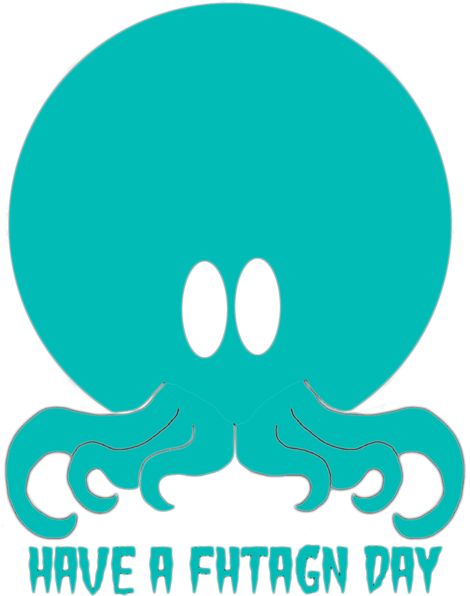

# CMD Internetstandaarden '14
> If debugging is the process of removing software bugs, then programming must be the process of putting them in. - Edsger Dijkstra.

!

# Zijn er vragen?

- over het college
- over de opzet van het vak
- over het leeswerk uit het boek
- over het huiswerk op codecademy.com

!

# Weekoverzicht

<table class="vakoverzicht">
  <tr>
    <th>Week</th>
    <th>College</th>
    <th>Werkgroep</th>
    <th>Studielab</th>
  </tr>
  <tr class="done">
    <td>37</td>
    <td>Introductie, werkwijze, overzicht en toetsing van het vak</td>
    <td>Installatie tools en eerste kennismaking met de materie</td>
    <td>dinsdag 10.10-13.00 medialounge</td>
  </tr>
  <tr class="done">
    <td>38</td>
    <td>Historie van het internet, semantische HTML en client-server architectuur</td>
    <td>Criteria voor een goede website, beoordelingsformulier</td>
    <td>dinsdag 10.10-13.00 medialounge</td>
  </tr>
  <tr class="done">
    <td>39</td>
    <td>The internet is made of hypertext, semantiek vs. syntaxis</td>
    <td>Omgaan met aangeleverde content, teksten in HTML zetten</td>
    <td>dinsdag 10.10-13.00 medialounge</td>
  </tr>
  <tr>
    <td>40</td>
    <td>Add some style, over de principes van css: kleur &amp; typografie</td>
    <td><strong>Aanwezigheid verplicht!</strong> Feedbacksessie HTML, een demo van de mogelijkheden van CSS</td>
    <td>dinsdag 10.10-13.00 medialounge</td>
  </tr>
  <tr>
    <td>41</td>
    <td>Layout met CSS, het box-model en menustructuren</td>
    <td>Layout voor eindopdracht schetsen met wireframes en deze proberen werkend te maken</td>
    <td>dinsdag 10.10-13.00 medialounge</td>
  </tr>
  <tr class="empty">
    <td>42</td>
    <td colspan="3">Herfstreces</td>
  </tr>
  <tr>
    <td>43</td>
    <td>Over het gebruik van afbeeldingen tabellen en formulieren. Javascript FTW!</td>
    <td>Werken aan eindopdracht</td>
    <td>dinsdag 10.10-13.00 medialounge</td>
  </tr>
  <tr>
    <td>44</td>
    <td>Responsie en tentamenvoorbereiding</td>
    <td><strong>Aanwezigheid verplicht!</strong> Feedbacksessie CSS</td>
    <td>dinsdag 10.10-13.00 medialounge</td>
  </tr>
  <tr>
    <td>45</td>
    <td><strong>Tentamen op 5 november!</strong></td>
    <td><strong>Eindopdracht indienen!</strong> 2 november 23.59u via Moodle</td>
  </tr>
</table>

!

# Feedback geven

Regels voor feedback:

- feedback is een cadeautje (geen weerwoord)
- feedback die je niet begrijpt is zinloos (stel vragen)
- feedback is specifiek (geen vaagheden)
- feedback heeft betrekking op aanwijsbare zaken (regelnummers)
- feedback is niet de oplossing weggeven (niet verbeteren)
- feedback activeert (je _moet_ er iets mee doen)

!

# Feedbacksessie HTML

Geef aan de hand van het beoordelingsformulier feedback, geef bij elk punt ook een tekstuele uitleg zodat de ontvanger _verstaat_ wat jouw feedback precies inhoud.

!

# Hoog tijd voor een CSS demo!

Gewoon even zitten en luisteren, de voorbeelden staan online en kan je gebruiken als inspiratie. IOW: je hoeft niet mee te typen!

Een kolom's layout: [demo/one.html](demo/one.html)

Drie kolom's layout: [demo/three.html](demo/three.html)

Hello Cthulhu!: [demo/index.html](demo/index.html)

!

# Zelfwerkzaamheid

Neem rustig de tijd om de feedback die je hebt ontvangen te verwerken in jouw website. Kijk goed of je de feedback begrijpt, als dat niet het geval is: stel vragen!

!

# Recap

- Hoe beter de feedback die je elkaar geeft, hoe beter het eindproduct

!

# Huiswerk

- (Uit HTML & CSS: Lees hoofdstukken 5 en 6)
- Na college: Uit HTML & CSS: Lees hoofdstukken 7 en 8 tot p187
- Op codecademy.com uit de HTML & CSS track: CSS: An Overview en CSS Selectors
- Maak het HTML gedeelte van je eindopdracht af zodat je voldoet aan de volgende criteria:
