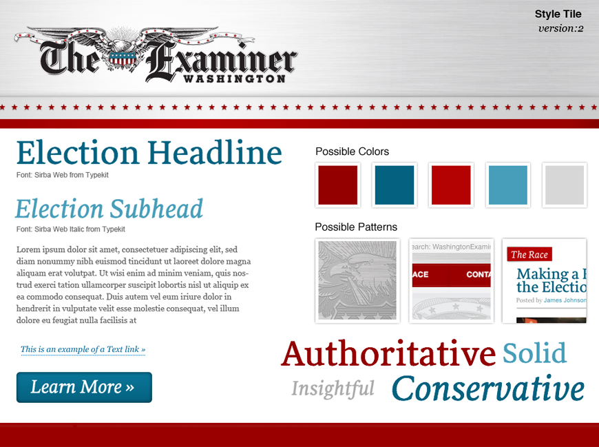

# CMD Internetstandaarden '14
> Nail the basics first, detail the details later. — Chris Anderson


!

# Zijn er vragen?

- over het college
- over de opzet van het vak
- over het leeswerk uit het boek
- over het huiswerk op codecademy.com

!

# Weekoverzicht

<table class="vakoverzicht">
  <tr>
    <th>Week</th>
    <th>College</th>
    <th>Werkgroep</th>
    <th>Studielab</th>
  </tr>
  <tr class="done">
    <td>37</td>
    <td>Introductie, werkwijze, overzicht en toetsing van het vak</td>
    <td>Installatie tools en eerste kennismaking met de materie</td>
    <td>dinsdag<br/>10.10-13.00 medialounge</td>
  </tr>
  <tr class="done">
    <td>38</td>
    <td>Historie van het internet, semantische HTML en client-server architectuur</td>
    <td>Criteria voor een goede website, beoordelingsformulier</td>
    <td>dinsdag<br/>10.10-13.00 medialounge</td>
  </tr>
  <tr class="done">
    <td>39</td>
    <td>The internet is made of hypertext, semantiek vs. syntaxis</td>
    <td>Omgaan met aangeleverde content, teksten in HTML zetten</td>
    <td>dinsdag<br/>10.10-13.00 medialounge</td>
  </tr>
  <tr class="done">
    <td>40</td>
    <td>Add some style, over de principes van css: kleur &amp; typografie</td>
    <td><strong>Aanwezigheid verplicht!</strong> Feedbacksessie HTML, een demo van de mogelijkheden van CSS</td>
    <td>dinsdag<br/>10.10-13.00 medialounge</td>
  </tr>
  <tr>
    <td>41</td>
    <td>Layout met CSS, het box-model en menustructuren</td>
    <td>Layout voor eindopdracht schetsen met wireframes en deze proberen werkend te maken</td>
    <td>dinsdag<br/>10.10-13.00 medialounge</td>
  </tr>
  <tr class="empty">
    <td>42</td>
    <td colspan="3">Herfstreces</td>
  </tr>
  <tr>
    <td>43</td>
    <td>Over het gebruik van afbeeldingen tabellen en formulieren. Javascript FTW!</td>
    <td>Werken aan eindopdracht</td>
    <td>dinsdag<br/>10.10-13.00 medialounge</td>
  </tr>
  <tr>
    <td>44</td>
    <td>Responsie en tentamenvoorbereiding</td>
    <td><strong>Aanwezigheid verplicht!</strong> Feedbacksessie CSS</td>
    <td>dinsdag<br/>10.10-13.00 medialounge</td>
  </tr>
  <tr>
    <td>45</td>
    <td><strong>Tentamen op 5 november!</strong></td>
    <td><strong>Eindopdracht indienen!</strong><br/>2 november 23.59u via Moodle</td>
  </tr>
</table>

!

# Instant Quiz 1

```
h1 {
    font-family: Garamond, serif;
    color: #00ff00;
    font-style: italic;
    text-align: right;
}
```
Hoe komen &lt;h1> elementen er uit te zien?
<h1 style="font-family: Garamond, serif; color: #00ff00; font-style: italic; text-align: right;">A) Dit is een h1!</h1>
<h1 style="font-family: Helvetica, sans-serif; color: #0000ff; font-style: italic; text-align: right;">B) Dit is een h1!</h1>
<h1 style="font-family: Garamond, serif; color: #00ff00; font-style: italic; text-align: left;">C) Dit is een h1!</h1>
<h1 style="font-family: Helvetica, sans-serif; color: #666; font-style: italic; text-align: left;">D) Dit is een h1!</h1>

!

# Instant Quiz 2
```
p {
    font-family: Menlo, monotype;
    color: rgb(33,33,33);
    text-align: justify;
}
```

<p style="font-family: Menlo, monotype; color: rgb(33,33,33); text-align: justify;">A) The unicorn is a legendary animal that has been described since antiquity as a beast with a large, pointed, spiraling horn projecting from its forehead.</p>

<p style="font-family: Arial, sans-serif; color: rgb(90,90,90); text-align: left;">B) The unicorn is a legendary animal that has been described since antiquity as a beast with a large, pointed, spiraling horn projecting from its forehead.</p>

<p style="font-family: Garamons, serif; color: rgb(120,120,120); text-align: right;">C) The unicorn is a legendary animal that has been described since antiquity as a beast with a large, pointed, spiraling horn projecting from its forehead.</p>
!

# Instant Quiz 3
```

```

!

# Instant Quiz 4
```

```

!

# Yet Another CSS demo!

Gewoon even zitten en luisteren, de voorbeelden staan online en kan je gebruiken als inspiratie. IOW: je hoeft niet mee te typen!


Layout met het menu links: [demo/menuleft.html](demo/menuleft.html)

Layout met het menu rechts: [demo/menuright.html](demo/menuright.html)

!

# Vlakverdeling

Op alle pagina's kan je een vlakverdeling herkennen


!

# Vlakverdeling

Die vlakverdeling wordt gemaakt met zogenaamde block-level elementen in HTML welke gepositioneerd worden met CSS


!

# Vlakverdeling

We noemen zo'n vlakverdeling een wireframe, als het goed is hebben jullie bij het project al kennis gemaakt met wireframes.


!

# Vlakverdeling

Bij het nadenken over de layout van een website zijn wireframes erg handig. Je kunt makkelijker afspraken met opdrachtgevers maken als er een goed beeld is van het eindproduct wat ze kunnen verwachten (verwachtingsmanagement). Aankomend hoorcollege gaat over vlakverdeling en positionering met CSS.


!

# Jouw vlakverdeling, kleur en typografie

- Schets (in grote lijnen) de vlakverdeling voor jouw webpagina
- Bedenk welk(e) lettertype(n) je wilt gebruiken op jouw site (max 2)
- Bedenk een kleurenschema voor jouw website (kuler.adobe.com)
- Een tool die je kunt gebruiken is de styletile, zie onder (styletil.es)




!

# Huiswerk

- Uit HTML & CSS: Lees hoofdstukken 7 en 8 tot p187
- Op codecademy.com uit de HTML & CSS track: CSS: An Overview en CSS Selectors
- Zorg dat je de wireframes, lettertypes en kleurenschema voor jouw website vastgesteld en bij je hebt, je kunt dit doen in een styletile (styletil.es)
- Begin met het vastleggen van de typografie en kleuren van jouw site in CSS
